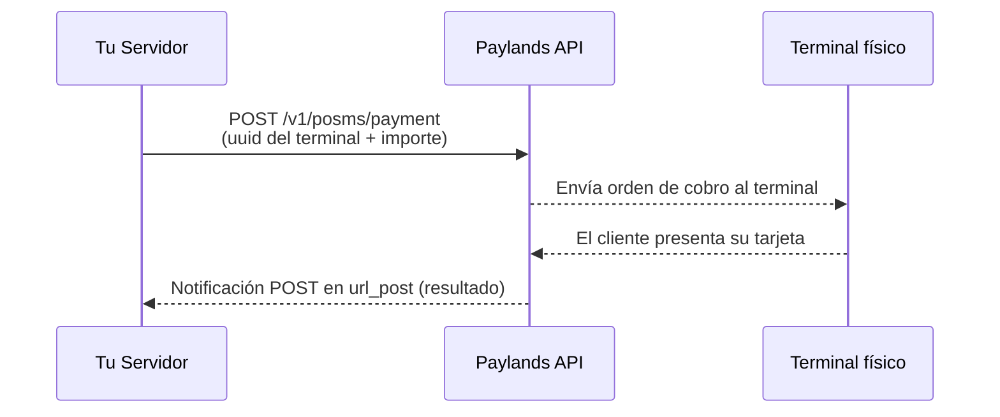

El sistema **POSMS** (Point Of Sale Management System) de Paylands permite gestionar terminales de pago físicos (datáfonos) desde tu servidor mediante API. En lugar de que el cliente interactúe directamente con el terminal, tú envías la orden de cobro desde tu backend y el terminal la ejecuta de forma automática.

Este modelo es ideal para **kioscos**, **restaurantes**, **tiendas físicas** o cualquier entorno donde el terminal y el software de gestión están integrados en el mismo sistema.

---

## Flujo de integración



---

## Endpoints disponibles

| Operación | Método | Endpoint |
|---|---|---|
| Enviar pago | `POST` | `/v1/posms/payment` |
| Enviar devolución | `POST` | `/v1/posms/refund` |
| Enviar preautorización | `POST` | `/v1/posms/preauthorization` |
| Confirmar preautorización | `POST` | `/v1/posms/confirmation` |
| Cancelar preautorización | `POST` | `/v1/posms/cancellation` |
| App2App (pago móvil) | `POST` | `/v1/posms/app2app` |

Consulta la [Referencia API → POSMS](/reference/#tag/POSMS-Dispositivos-fisicos) para la especificación completa de cada endpoint.

---

## Paso 1 — Enviar una orden de pago al terminal

Realiza una petición `POST` indicando el UUID del terminal y el importe del cobro. Paylands se encarga de enviar la orden al dispositivo físico.

```bash
curl --request POST 'https://api.paylands.com/v1/sandbox/posms/payment' \
  --header 'Authorization: pk_test_3c140607778e1217f56ccb8b50540e00' \
  --header 'Content-Type: application/json' \
  --data-raw '{
    "signature": "341f7de8e6fc49da8d8736473af6b03a",
    "terminal_uuid": "A1B2C3D4-E5F6-7890-ABCD-EF1234567890",
    "amount": 1500,
    "description": "Mesa 12 - Pedido #42",
    "url_post": "https://mi.restaurante.com/paylands/notificacion",
    "url_ok": "https://mi.restaurante.com/ok",
    "url_ko": "https://mi.restaurante.com/ko",
    "customer_ext_id": "mesa_12",
    "reference": "PEDIDO-42"
  }'
```

<Tip>
  El campo `amount` se expresa en la **unidad fraccionaria de la moneda**. Por ejemplo, `1500` equivale a **15,00 €**.
</Tip>

### Respuesta — Pago enviado al terminal

```json
{
  "message": "OK",
  "code": 200,
  "order": {
    "uuid": "BD2E0C35-E891-4CF7-8F95-7D044560D372",
    "amount": 1500,
    "currency": "978",
    "paid": false,
    "status": "CREATED"
  }
}
```

El terminal recibirá la orden de pago y quedará en espera de que el cliente presente su tarjeta.

---

## Paso 2 — Recibe la notificación del resultado

Una vez el cliente completa (o cancela) el pago en el terminal, Paylands envía una notificación `POST` a tu `url_post`:

```json
{
  "message": "OK",
  "code": 200,
  "order": {
    "uuid": "BD2E0C35-E891-4CF7-8F95-7D044560D372",
    "amount": 1500,
    "paid": true,
    "status": "SUCCESS",
    "transactions": [
      {
        "uuid": "595E1818-A4E3-4A16-92A5-1DC6988162CC",
        "operative": "AUTHORIZATION",
        "amount": 1500,
        "status": "SUCCESS",
        "error": "NONE",
        "source": {
          "object": "CARD",
          "brand": "VISA",
          "last4": "1234",
          "entry_mode": "CONTACT"
        }
      }
    ]
  },
  "validation_hash": "2db16932777640d5a9d2aa60b5308a70..."
}
```

<Warning>
  Verifica siempre el `validation_hash` antes de confirmar el pedido en tu sistema. Consulta la guía de [Validación de notificaciones](/guides/resources/notification-validation).
</Warning>

---

## Preautorizaciones

Las preautorizaciones permiten **reservar el importe** en la tarjeta del cliente para confirmarlo o liberarlo más tarde. Útil para hoteles, alquiler de vehículos, etc.

| Paso | Endpoint | Descripción |
|---|---|---|
| 1 | `POST /v1/posms/preauthorization` | Reserva el importe en la tarjeta |
| 2a | `POST /v1/posms/confirmation` | Confirma y cobra el importe (total o parcial) |
| 2b | `POST /v1/posms/cancellation` | Libera la reserva sin cobrar |

---

## Devoluciones

Para devolver un cobro procesado anteriormente:

```bash
curl --request POST 'https://api.paylands.com/v1/sandbox/posms/refund' \
  --header 'Authorization: pk_test_3c140607778e1217f56ccb8b50540e00' \
  --header 'Content-Type: application/json' \
  --data-raw '{
    "signature": "341f7de8e6fc49da8d8736473af6b03a",
    "terminal_uuid": "A1B2C3D4-E5F6-7890-ABCD-EF1234567890",
    "order_uuid": "BD2E0C35-E891-4CF7-8F95-7D044560D372",
    "amount": 1500
  }'
```

---

## Pruebas en sandbox

El simulador POSMS de Paylands acepta un **`amount` de 4 dígitos** para controlar exactamente la respuesta simulada. Cada dígito controla un aspecto distinto del resultado:

```
amount = D1 D2 D3 D4
```

### Dígito 1 — Estado de la transacción

| Dígito | Estado |
|---|---|
| `1` | `PAID` ✅ |
| `2` | `REFUSED` ❌ |
| `3` | `CANCELLED` |
| `4` | `EXPIRED` |
| `5` | `DUPLICATED` |
| `6` | `ERROR` |

### Dígito 2 — Marca de tarjeta

| Dígito | Marca |
|---|---|
| `1` | VISA |
| `2` | MASTERCARD |
| `3` | MAESTRO |
| `4` | AMERICAN EXPRESS |
| `5` | DISCOVER |
| `6` | DINERS CLUB INTERNATIONAL |
| `7` | JCB |
| `8` | UNIONPAY |
| `9` | INTERPAY |
| `0` | OTHER |

### Dígito 3 — Forma de pago (modo de entrada)

| Dígito | Modo de entrada |
|---|---|
| `1` | MAGNETIC (banda magnética) |
| `2` | MAGNETIC_FALLBACK |
| `3` | CONTACT (chip con contacto) |
| `4` | CLESS (contactless) |
| `5` | CLESS_MAGSTRIPE |
| `6` | MANUAL |
| `7` | CHIP |
| `8` | NON_PRESENTIAL |
| `9` | KEY_ENTRY |

### Dígito 4 — Método de autenticación

| Dígito | Autenticación |
|---|---|
| `1` | NO (sin autenticación) |
| `2` | SIGNATURE (firma) |
| `3` | PIN_ONLINE |
| `4` | PIN_OFFLINE |
| `5` | CONSUMER_DEVICE (dispositivo del consumidor) |
| `6` | UNKNOWN |

### Ejemplos de uso

<AccordionGroup>
  <Accordion title="Simular un pago OK con VISA, contactless y PIN online">
    Usa `amount: 1141`:
    - Dígito 1 → `1` = PAID
    - Dígito 2 → `1` = VISA
    - Dígito 3 → `4` = CLESS (contactless)
    - Dígito 4 → `1` = NO auth

    ```bash
    "amount": 1141
    ```
  </Accordion>

  <Accordion title="Simular un pago REFUSED con MASTERCARD, chip y PIN">
    Usa `amount: 2233`:
    - Dígito 1 → `2` = REFUSED
    - Dígito 2 → `2` = MASTERCARD
    - Dígito 3 → `3` = CONTACT (chip)
    - Dígito 4 → `3` = PIN_ONLINE

    ```bash
    "amount": 2233
    ```
  </Accordion>

  <Accordion title="Simular un pago cancelado con AMEX y firma">
    Usa `amount: 3412`:
    - Dígito 1 → `3` = CANCELLED
    - Dígito 2 → `4` = AMERICAN EXPRESS
    - Dígito 3 → `1` = MAGNETIC
    - Dígito 4 → `2` = SIGNATURE

    ```bash
    "amount": 3412
    ```
  </Accordion>
</AccordionGroup>

<Note>
  El simulador solo responde con combinaciones de 4 dígitos exactos en el campo `amount`. Para importes reales en producción, usa el valor en unidades fraccionarias de la moneda normalmente (ej. `1500` para 15,00 €).
</Note>

---

## Siguientes pasos

<CardGroup cols={2}>
  <Card title="Referencia API POSMS" icon="terminal" href="/reference/#tag/POSMS-Dispositivos-fisicos">
    Especificación completa de todos los endpoints de POSMS.
  </Card>
  <Card title="Validar notificaciones" icon="check-double" href="/guides/resources/notification-validation">
    Cómo verificar el hash de las notificaciones POST.
  </Card>
  <Card title="Preautorizaciones" icon="clock" href="/guides/features/cards">
    Gestión de reservas de importe y captura diferida.
  </Card>
  <Card title="Devoluciones" icon="rotate-left" href="/reference/#operation/refund">
    Cómo procesar devoluciones totales y parciales.
  </Card>
</CardGroup>
