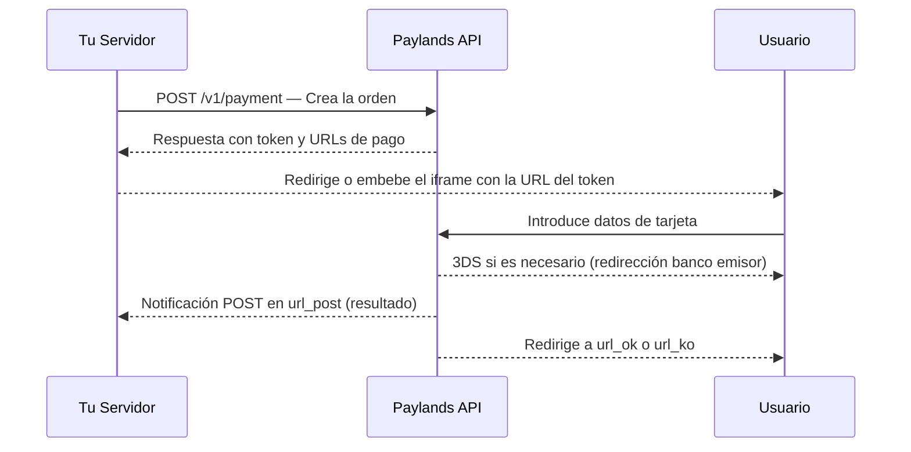

La **carta de pago por redirección** de Paylands es la forma más sencilla y segura para cobrar a tus clientes online. El usuario ve un formulario alojado por Paylands donde introduce los datos de su tarjeta — sin que tu servidor toque en ningún momento datos sensibles de pago.

La integración puede realizarse de dos formas:
- **Redirección completa**: el usuario abandona tu web momentáneamente para completar el pago.
- **Iframe embebido**: el formulario se embebe en tu web y el usuario no percibe el cambio de contexto.


---

## Características

<CardGroup cols={2}>
  <Card title="Sin fricción" icon="bolt">
    Validación de tarjetas en tiempo real con mensajes de error incorporados.
  </Card>
  <Card title="Responsive" icon="mobile">
    Diseño totalmente adaptado a dispositivos móviles y tablets.
  </Card>
  <Card title="Múltiples métodos de pago" icon="credit-card">
    Admite tarjeta, Bizum, wallets y APMs según tu configuración.
  </Card>
  <Card title="3D Secure y PCI" icon="shield-halved">
    Admite 3DS. Cumplimiento PCI simplificado y listo para SCA.
  </Card>
  <Card title="Internacional" icon="globe">
    Soporta 14 idiomas de forma automática.
  </Card>
  <Card title="Personalizable" icon="paintbrush">
    Logo, colores y botones ajustables desde el panel de Paylands.
  </Card>
</CardGroup>

---

## Flujo de integración



---

## Paso 1 — Genera la orden de pago en tu servidor

Realiza una petición `POST` al endpoint de pago desde tu backend con los parámetros del cobro. Paylands devuelve un objeto `order` y un `token` que usarás para construir la URL de la carta de pago.

```bash
curl --request POST 'https://api.paylands.com/v1/sandbox/payment' \
  --header 'Authorization: pk_test_3c140607778e1217f56ccb8b50540e00' \
  --header 'Content-Type: application/json' \
  --data-raw '{
    "signature": "341f7de8e6fc49da8d8736473af6b03a",
    "amount": 100,
    "operative": "AUTHORIZATION",
    "secure": false,
    "customer_ext_id": "user_123",
    "service": "9A1BDCC8-DB30-4ED2-8523-62B330A67873",
    "description": "Pedido #1234",
    "url_post": "https://mi.tienda.com/paylands/notificacion",
    "url_ok": "https://mi.tienda.com/pago/ok",
    "url_ko": "https://mi.tienda.com/pago/ko",
    "save_card": false,
    "reference": "ORDER-1234",
    "expires_in": 3600
  }'
```

<Tip>
  El campo `amount` se expresa en la **unidad fraccionaria de la moneda**. Para Euros, `100` equivale a **1,00 €**. Para conocer todos los parámetros disponibles consulta la [Referencia API → Generar Orden de pago](/reference/#operation/generate-payment-order).
</Tip>

### Respuesta

La respuesta incluye el `token` de la orden y las **URLs de pago autogeneradas** en el campo `urls`:

```json
{
  "message": "OK",
  "code": 200,
  "order": {
    "uuid": "BD2E0C35-E891-4CF7-8F95-7D044560D372",
    "amount": 100,
    "currency": "978",
    "paid": false,
    "status": "CREATED",
    "token": "1f663c102b3f9c3c2e7085f519c7462a6440868fe9337ea8...",
    "urls": {
      "payment_card": "https://api.paylands.com/v1/sandbox/payment/process/1f663c...",
      "bizum": "https://api.paylands.com/v1/sandbox/payment/bizum/1f663c...",
      "3ds_tokenized": "https://api.paylands.com/v1/sandbox/payment/tokenized/1f663c..."
    }
  }
}
```

<Note>
  Las URLs en `urls.payment_card`, `urls.bizum` y `urls.3ds_tokenized` se generan automáticamente. Las URLs abreviadas (p.ej. `https://api.paylands.com/su/tOIZRL7BhmEp`) pueden habilitarse desde **Panel → Administración → Clientes → Preferencias de configuración → Generar urls abreviadas**.
</Note>

---

## Paso 2 — Redirige al usuario al formulario de pago

Con el `token` obtenido en la respuesta, construye la URL de la carta de pago:

```
https://api.paylands.com/v1/payment/process/{TOKEN}
```

### Opción A: Redirección completa

El usuario es redirigido a la carta de pago de Paylands para completar el pedido.

```js
// Ejemplo en Node.js / Express
res.redirect(`https://api.paylands.com/v1/payment/process/${order.token}`);
```

### Opción B: Iframe embebido

El formulario de pago se incrusta en tu página sin que el usuario abandone tu web.

```html
<iframe
  id="paylands-checkout"
  title="Pago seguro con Paylands"
  width="600"
  height="800"
  src="https://api.paylands.com/v1/payment/process/{TOKEN}"
  frameborder="0"
  allow="payment">
</iframe>
```

<Tip>
  Puedes personalizar la **apariencia** de la carta de pago (logo, colores, fuente) desde el **Panel de Paylands → Personalización → [Plantillas](https://backend.paylands.com/templates)**. Crea una plantilla de tipo *Carta de pago* e indica su `template_uuid` al generar la orden.
</Tip>

---

## Paso 3 — Recibe la notificación en tu servidor

Una vez el usuario completa el pago (o falla), Paylands envía una notificación `POST` a la URL que indicaste en `url_post`, con el objeto `order` actualizado:

```json
{
  "message": "OK",
  "code": 200,
  "order": {
    "uuid": "495BEE1F-7D00-4E4B-9511-F1665118932F",
    "amount": 100,
    "currency": "978",
    "paid": true,
    "status": "SUCCESS",
    "transactions": [
      {
        "uuid": "595E1818-A4E3-4A16-92A5-1DC6988162CC",
        "operative": "AUTHORIZATION",
        "amount": 100,
        "status": "SUCCESS",
        "error": "NONE",
        "source": {
          "object": "CARD",
          "uuid": "6C5D535E-1B5B-4665-8A32-08ADF2A680B7",
          "brand": "VISA",
          "last4": "0016",
          "holder": "Jose Garcia",
          "is_saved": true,
          "cof": { "is_available": true }
        }
      }
    ]
  },
  "validation_hash": "2db16932777640d5a9d2aa60b5308a70aba29a3a4ee410d103f0b8a3b7e0cc5f"
}
```

<Warning>
  Siempre verifica el `validation_hash` antes de actualizar el estado de tu pedido. Consulta la guía de [Validación de notificaciones](/guides/resources/notification-validation) para saber cómo calcularlo.
</Warning>

El campo `source.uuid` dentro de la transacción es el **token de la tarjeta** tokenizada. Puedes guardarlo para cobrar al mismo usuario en el futuro sin pedirle de nuevo los datos de tarjeta. Consulta la guía de [Tarjetas y tokenización](/guides/features/cards).

---

## Paso 4 — El usuario es redirigido de vuelta a tu web

Tras completar (o fallar) el pago, Paylands redirige al usuario automáticamente:

| Resultado | Redirección |
|---|---|
| ✅ Pago exitoso | `url_ok` que indicaste al crear la orden |
| ❌ Pago fallido o cancelado | `url_ko` que indicaste al crear la orden |


---

## URLs de pago disponibles

Al generar la orden, la respuesta incluye hasta tres URLs según tu configuración de servicios:

| URL | Descripción | Requisitos |
|---|---|---|
| `urls.payment_card` | Carta de pago con tarjeta | Siempre disponible |
| `urls.bizum` | Formulario de Bizum | El servicio debe soportar Bizum |
| `urls.3ds_tokenized` | Pago tokenizado con 3DS | Require `secure: true` y `source_uuid` válido |

---

## Siguientes pasos

<CardGroup cols={2}>
  <Card title="Guardar y reusar tarjetas" icon="floppy-disk" href="/guides/features/cards">
    Tokeniza tarjetas para cobros recurrentes sin fricción.
  </Card>
  <Card title="Validar notificaciones" icon="check-double" href="/guides/resources/notification-validation">
    Aprende a verificar el hash de las notificaciones POST.
  </Card>
  <Card title="Personalizar la carta de pago" icon="paintbrush" href="/guides/features/customization">
    Ajusta colores, logo y diseño del formulario de pago.
  </Card>
  <Card title="Webhooks" icon="webhook" href="/guides/features/webhooks">
    Gestiona eventos de pago en tiempo real con webhooks.
  </Card>
</CardGroup>
